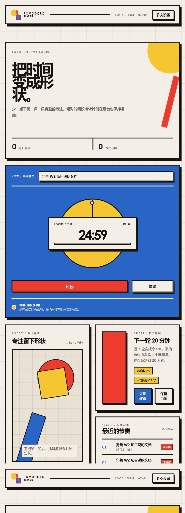

# 番茄钟

一个面向学生与轻量办公用户的浏览器番茄钟。项目采用 React、TypeScript 与 Vite，以包豪斯视觉实现精准计时、本地持久化、专注记录和可解释的自适应时长建议。



## 核心特性

- 专注与休息双模式，支持开始、暂停、继续、重置。
- 使用绝对结束时间校准，降低浏览器后台节流造成的误差。
- 刷新或重新聚焦页面后恢复正确剩余时间。
- 本地保存任务、设置和最近专注记录，无需账号。
- 根据最近完成率与暂停次数给出可解释的时长建议。
- 15–50 分钟建议边界和两轮冷却机制，避免频繁来回调整。
- 包豪斯三原色、硬边框、错位阴影和几何海报。
- 390px 手机视口无横向滚动，支持键盘焦点与减少动态效果。

## 快速开始

环境要求：Node.js 20 或更高版本，npm 10 或更高版本。

```bash
npm install
npm run dev
```

浏览器访问终端给出的本地地址，默认通常为 `http://127.0.0.1:5173/`。

## 测试与构建

```bash
npm test
npx tsc -p tsconfig.app.json --noEmit
npx vite build
```

当前验证结果：10 项单元测试全部通过，TypeScript 类型检查通过，Vite 生产构建通过。

## 使用方法

1. 在“当前任务”输入框写下本轮目标。
2. 点击“开始专注”。
3. 需要临时中断时点击“暂停”，随后可继续。
4. 若主动重置正在进行的专注，本轮会作为未完成样本进入记录。
5. 完成至少三轮后，系统根据完成率与暂停次数显示节奏建议。
6. 用户可采用建议，也可保持当前时长；所有选择都由用户控制。

详细操作见 [用户操作手册](docs/用户操作手册.md)。

## 项目结构

```text
src/
├─ components/             # 计时器、建议、历史、几何海报
├─ hooks/                  # 精准计时状态与恢复逻辑
├─ lib/                    # 时间工具与推荐算法
├─ services/               # 本地存储
├─ __tests__/              # 单元测试
├─ App.tsx
└─ styles.css
docs/                      # Markdown 与 LaTeX 项目文档
evidence/                  # 真实运行、代码、测试和 AI 证据
```


## 数据与隐私

项目使用浏览器 `localStorage` 保存计时状态、设置和最近记录。数据不会主动上传。清理浏览器站点数据会删除这些记录。

## 文档

- [界面与交互设计](docs/界面与交互设计.md)
- [竞品横向对比](docs/竞品横向对比.md)
- [Prompt 与 Ai Coding 记录](docs/Prompt与AiCoding记录.md)
- [开发决策与调试记录](docs/开发决策与调试记录.md)
- [用户操作手册](docs/用户操作手册.md)

## 说明

本仓库为 2026 年 W2 大模型编程实习项目。最终答辩 PPT 由小组另行制作，不在本仓库交付范围内。
