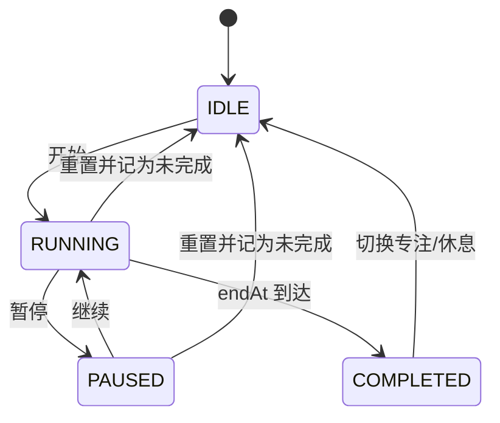

# 番茄钟架构设计

## 1. 技术栈

- React 19：组件与状态管理。
- TypeScript 5：类型约束与严格检查。
- Vite 7：开发服务器与生产构建。
- Vitest：纯函数单元测试。
- CSS：设计令牌、响应式布局和包豪斯视觉。
- localStorage：本地持久化，无服务端依赖。

## 2. 模块结构

```text
App
├─ TimerDial                 计时状态、进度与模式显示
├─ GeometricPoster          完成记录的几何可视化
├─ RecommendationPanel      可解释建议与用户选择
├─ SessionHistory           最近专注记录
├─ usePrecisionTimer        状态机、绝对时间校准、刷新恢复
├─ recommendation.ts        自适应建议纯函数
├─ time.ts                  剩余时间、格式化和边界工具
└─ storage.ts               计时、设置与记录持久化
```

## 3. 数据流

1. `App` 从 `storage` 读取设置和历史。
2. `usePrecisionTimer` 读取并恢复计时快照。
3. 用户启动后保存 `endAt = Date.now() + remainingMs`。
4. 回调只触发界面刷新，真实剩余时间始终由 `endAt - Date.now()` 计算。
5. 完成时生成 `FocusSession`，写入最近记录。
6. `createRecommendation` 读取最近样本并返回建议或 `null`。
7. 用户接受后更新设置；拒绝后进入两轮冷却。

## 4. 计时状态机



## 5. 精准计时设计

普通实现常用 `setInterval` 每秒将状态减一。浏览器进入后台后回调可能降频，累计误差会逐步放大。本项目把绝对结束时间作为事实来源：

```text
endAt = now + remainingMs
remainingMs = max(0, endAt - now)
```

定时器只负责触发重新计算；`visibilitychange`、窗口 `focus` 和刷新恢复都会再次对齐绝对时间。`handledEndAtRef` 用于保证同一轮完成回调只执行一次。

## 6. 推荐算法设计

推荐函数保持纯函数形式，输入历史记录、当前时长和上次建议时的记录数量，输出结构化建议。纯函数便于覆盖触发条件、上下界和冷却行为，不依赖界面或存储。

算法只使用完成率与暂停次数，因此称为“可解释的行为驱动推荐”，不宣传为机器学习模型。

## 7. 持久化模型

```text
bauhaus-focus/timer/v1      当前计时快照
bauhaus-focus/sessions/v1   最近 30 条专注记录
bauhaus-focus/settings/v1   时长、任务与建议冷却状态
```

解析失败时使用默认值，防止损坏数据阻断启动。

## 8. 关键技术取舍

- 不引入状态管理库：当前数据规模小，React 状态与 Hook 更直接。
- 不引入组件库：需要精确实现用户给定的包豪斯视觉，原生 CSS 体积更小。
- 不提供后端：满足本地优先和隐私目标，也降低本周交付风险。
- 不把所有逻辑放入 `App.tsx`：计时、推荐和存储分离，便于测试与审查。
