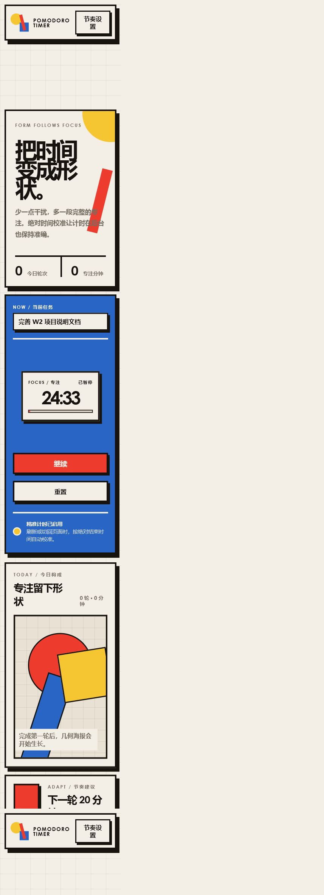
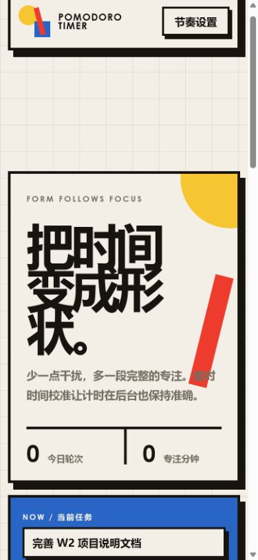

# 番茄钟用户操作手册

## 1. 安装与启动

### 环境要求

- Node.js 20 或更高版本。
- npm 10 或更高版本。
- Chrome、Edge、Firefox 等现代浏览器。

### 启动步骤

```bash
npm install
npm run dev
```

打开终端显示的本地地址。开发环境通常为 `http://127.0.0.1:5173/`。

## 2. 开始一轮专注

1. 在“当前任务”输入框写下本轮目标。
2. 检查计时器显示“专注”和“准备”。
3. 点击“开始专注”。
4. 按钮变为“暂停”，状态显示“进行中”。


## 3. 暂停、继续与重置

- 点击“暂停”会冻结当前剩余时间。
- 点击“继续”会以冻结后的剩余时间重新计算结束时间。
- 运行或暂停时点击“重置”，当前轮次会作为未完成样本保存，然后回到完整时长。
- 准备状态点击“重置”只恢复当前模式的默认时长，不新增记录。

## 4. 结束与模式切换

- 专注计时结束后显示“已完成”和“进入休息”。
- 点击“进入休息”切换到休息模式。
- 休息结束后点击“开始下一轮”回到专注模式。

## 5. 调整节奏

1. 点击顶栏“节奏设置”。
2. 专注时长可在 15–50 分钟间按 5 分钟调整。
3. 休息时长可在 5–15 分钟间按 5 分钟调整。
4. 正在计时或暂停时滑块会锁定，防止误改当前轮次。

## 6. 自适应建议

系统至少观察三条记录后才生成建议。建议卡会显示：

- 建议的下一轮分钟数；
- 最近样本完成率；
- 平均暂停次数；
- 增加、减少或保持的原因。

用户可点击“采用建议”，也可点击“保持当前”。建议不是强制操作。



## 7. 今日几何海报与记录

- 每条完成记录参与生成几何形状。
- 今日统计显示完成轮次与专注分钟。
- 最近记录显示任务、时间、分钟数和完成状态。

## 8. 数据与隐私

所有数据保存在当前浏览器的 `localStorage`，项目不会主动上传数据。以下操作可能导致记录丢失：

- 清理该站点的浏览器数据；
- 使用隐私模式后关闭窗口；
- 更换浏览器或设备。

## 9. 手机使用

页面会在手机宽度改为单列，功能不会被隐藏。推荐使用竖屏；按钮保持足够触控高度。



## 10. 常见问题

### 切到其他标签页后时间会停止吗？

不会依赖每秒回调累计。切回页面时会按绝对结束时间重新计算剩余时间。

### 为什么完成三轮前没有建议？

样本过少容易产生不稳定判断，因此至少三条记录后才显示建议。

### 为什么建议不是 AI 大模型生成？

本项目使用透明规则，用户可以看见输入指标和原因。它更容易验证，也避免把简单规则误称为大模型。

### 能跨设备同步吗？

当前版本不支持。项目选择本地优先以减少登录成本并明确隐私边界。
